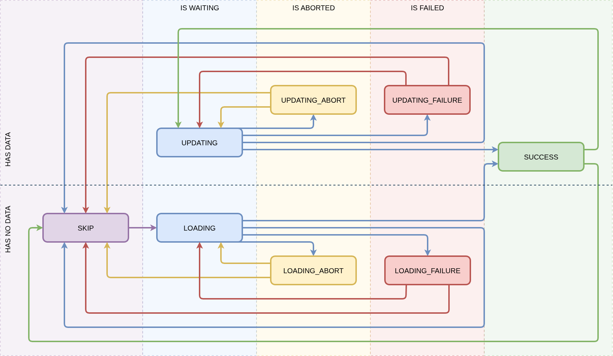

# @recrafter/async

_React hooks and components for managing async state_

[](https://www.npmjs.com/package/@recrafter/async)
[](LICENSE)

## Features

- Declarative async state management for React
- Hooks for manual (`useAsync`) and automatic (`useAutoAsync`) async actions
- Component (`AsyncGuard`) for rendering UI based on async state
- Automatic request cancellation via `AbortController` on unmount or variable
  changes
- Fully typed discriminated union states with automatic type narrowing

## Installation

```bash
npm i react @types/react @recrafter/async
```

## Quick Example

```tsx
import React from 'react';
import {useAutoAsync, AsyncGuard} from '@recrafter/async';

// Simulate an async function
const fetchData = async ({
    variables,
    signal,
}: {
    variables: {id: number};
    signal: AbortSignal;
}) => {
    const response = await fetch(`/api/items/${variables.id}`, {signal});
    return response.json() as Promise<{message: string}>;
};

export function Example() {
    const [asyncState, asyncActions] = useAutoAsync({
        createPromise: fetchData,
        variables: {id: 1},
    });

    return (
        <AsyncGuard
            {...asyncState}
            loadingSlot={<div>Loading...</div>}
            loadingFailureSlot={({reason}) => (
                <div>Error: {String(reason)}</div>
            )}
            children={({data}) => <div>Result: {data.message}</div>}
        />
    );
}
```

## API

### `useAsync`

Manual control over async actions.

```ts
const [asyncState, asyncActions] = useAsync({
    createPromise,
    isSkipped, // optional
    initialAsyncState, // optional
});
```

- `createPromise`: ({ variables, signal }) => Promise<Data>
- `isSkipped`: boolean (optional)
- `initialAsyncState`: AsyncState<Data> (optional)

**Actions:**

- `asyncActions.start({ variables, onSuccess, onFailure, onFinally })`
  (`onSuccess`, `onFailure`, `onFinally` are optional)
- `asyncActions.abort()`

```ts
// Start (or restart) the request manually
asyncActions.start({
    variables: {id: 2},
    onSuccess: (data) => console.log(data),
});

// Cancel the in-flight request
asyncActions.abort();
```

### `useAutoAsync`

Automatically runs the async action on mount and when `variables` change.

```ts
const [asyncState, asyncActions] = useAutoAsync({
    createPromise,
    variables,
    isSkipped, // optional
    initialAsyncState, // optional
    onSuccess, // optional
    onFailure, // optional
    onFinally, // optional
});
```

- `createPromise`: ({ variables, signal }) => Promise<Data>
- `variables`: `Variables` (same type as in `createPromise`; used as a
  dependency)
- `isSkipped`, `initialAsyncState`, `onSuccess`, `onFailure`, `onFinally`:
  optional

**Actions:**

- `asyncActions.restart(updateArgs?)`
- `asyncActions.abort()`

```ts
// Re-run the request with the same variables (e.g. a "retry" button)
asyncActions.restart();

// Re-run with overridden callbacks for this call only
asyncActions.restart({onSuccess: (data) => console.log(data)});

// Cancel the in-flight request
asyncActions.abort();
```

### `AsyncGuard`

Component for rendering different UI based on async state.

```tsx
<AsyncGuard
    {...asyncState}
    loadingSlot={<div>Loading...</div>}
    loadingFailureSlot={({reason}) => <div>Error: {String(reason)}</div>}
    children={({data}) => <div>Result: {data}</div>}
/>
```

#### Slots

- `children`: Render on success (`status: SUCCESS`)
- `loadingSlot`, `loadingFailureSlot`, `loadingAbortSlot`, `updatingSlot`,
  `updatingFailureSlot`, `updatingAbortSlot`, `skipSlot`

Each slot can be a React element or a render function.

## AsyncState & Statuses

The async state returned by hooks is a discriminated union on the `status`
field:



- `status: SKIP` — Skipped
- `status: LOADING` — Loading
- `status: SUCCESS` — Success, has `data`
- `status: UPDATING` — Updating, has `data`
- `status: LOADING_FAILURE` — Loading failed, has `reason`
- `status: UPDATING_FAILURE` — Updating failed, has `data` and `reason`
- `status: LOADING_ABORT` — Loading aborted
- `status: UPDATING_ABORT` — Updating aborted, has `data`

Each state also has flags: `isWaiting`, `hasData`, `isFailed`, `isAborted`.

Because it's a discriminated union, narrowing on `status` (or on a flag like
`hasData`) lets TypeScript infer which fields are available — no optional
chaining or manual casts needed:

```ts
if (asyncState.status === ASYNC_STATUS.SUCCESS) {
    asyncState.data; // typed as Data, no cast needed
}

if (asyncState.hasData) {
    asyncState.data; // also narrowed here — true for SUCCESS, UPDATING,
    // UPDATING_FAILURE and UPDATING_ABORT
}
```

## License

MIT
